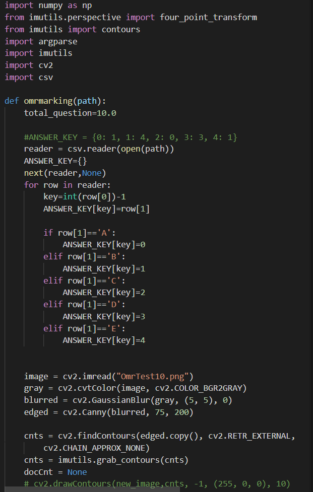
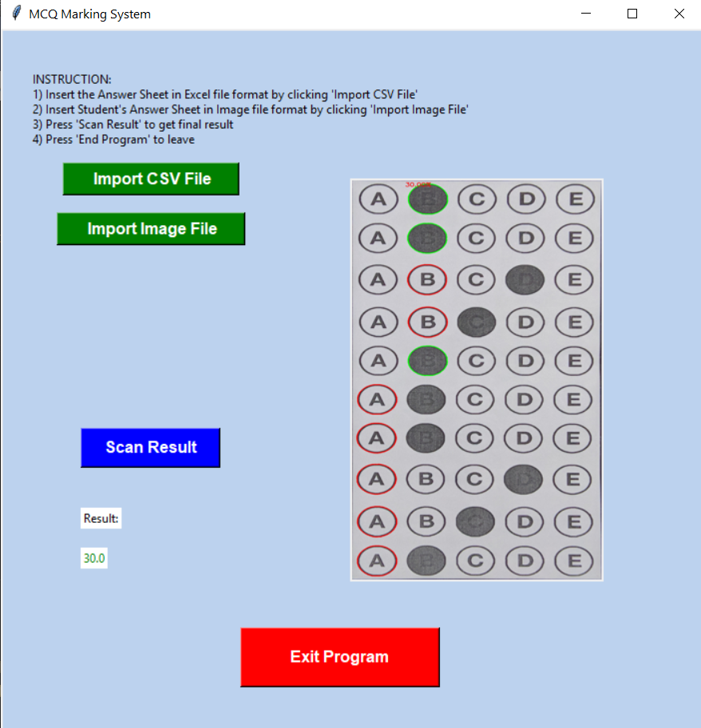

# **Section C: Implementing the Project Plan**
## Deliverables:
- A system that can mark MCQ sheets 

## Tasks and Estimated Costs

| Task      |Estimated Costs (RM)|Notes   |
|-----------|---------------|--------|
|Server Maintenance|5000.00|   |
|Office Maintenance|1000.00   |   |
|OCR Machine|30000.00||
|Office Rental     |2100.00   |   |
|Utility           |3600.00||
|Software          |200.00||
|Meals|8400.00||
|Transportation|7200.00||
|Salary|RM7200.00||
|Insurance|600.00||
|Office Supplies|360.00||
|Data Collection|5000.00||
|Conceptual design|300.00||
|Permits|5000.00||
|Preliminary design|40000.00||
|Assessments (evaluation)|4000.00||
|Final design|1500.00||
|**TOTAL**|**155960.00**||

 

## Milestone Chart
|Milestone      |Scheduled Completion|Actual Completion   |
|-----------|---------------|--------|
|Project Charter|29/10/2020|29/10/2020|
|Project Plan Management|11/11/2020|11/11/2020|
|Project Execution and Integration|4/1/2021 |4/1/2021|
|Quality Management|8/1/2021 |8/1/2021|
|Close Contract|13/1/2021|13/1/2021|
 

# **Section D: Executing the Project**
## Project Design and Coding

 

 

 

## Project Result

 

# **Section E: Completing The Project**
## Closing Checklist

**1) Customer Acceptance Form**   

  

**2) Lesson Learned Document**   

  

**3) Final Project Report**  
**MCQ MARKING SYSTEM**  
	
**3.1 PROJECT OBJECTIVES** 
The objectives of the MCQ Marking System which is developed by MCQ international Sdn. Bhd. is to:  
	a. To save time and reduce the costs of educator for OMR grading. 
	b. To reduce energy consumption of the educator for OMR grading. 
	c. To upgrade the existing grading system. 
  

**3.2 PROJECT RESULTS** 
This MCQ Marking System is developed successfully as the system is able to scan and grade the answer sheets correctly.
  

**3.3 ORIGINAL AND ACTUAL SCHEDULE** 
The project team members had sticked to the plan and all process are on track which followed the original schedule.  

  

**3.4 ORIGINAL AND ACTUAL BUDGET** 
The actual budget that we had used is RM 104440.00, which is RM 51520.00 more lower than the estimate budget costs.   

  

**3.5 PROJECT ASSESSMENT**  
**3.5.1 SCOPE**  
The project scope of this project is accomplished as the MCQ Marking System which are target to be used by teachers or examiner are able to perform efficiently. 
The examiners are able to save their time on marking the students'bubble answer sheets and the students can get their results in a shorter time.
  

**3.5.2 OBJECTIVES** 
The MCQ Marking System developed by the MCQ International Sdn. Bhd. are able to scan the OMR sheets by using Python and OpenCV. We had applied a perspective transform to 
extract the top-down, birds-eye-view of the exam. Extract the set of student's answer and examiner's answer bubbles sheets from the from the perspective transformed exam.
Then, we sort the question/bubbles into rows and marked them. By using this marking system, our objectives of this project is accomplished.
  

**3.5.3 SUCCESS CRITERIA** 
Success criteria listed in the project scope management is to complete this project within 4 months with an estimated budget cost of RM155,960. This project should be fulfilled all the customer’s requirements stated in the project scope management. 
The project manager should make sure that all team members are stay on track with the Gantt chart created and well controlled during the process in order to achieve the scope goals.
  

**3.5.4 TRANSITION PlAN**  

  

**3.5.5 CLOSE CONTRACT**  

  

# **Section F: PROJECT PRESENTATION**
