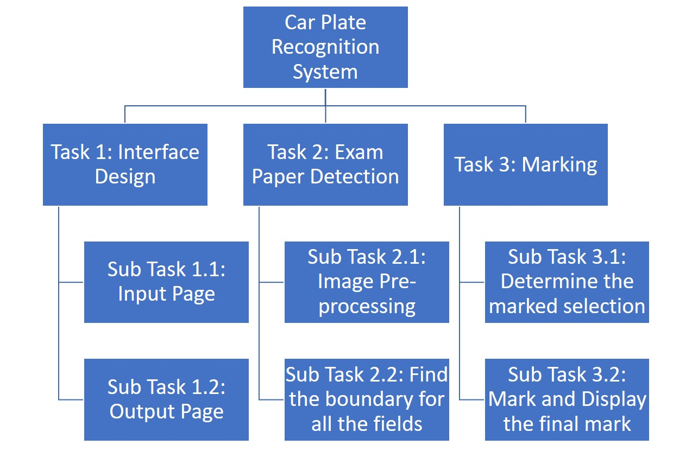
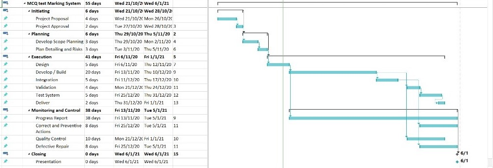
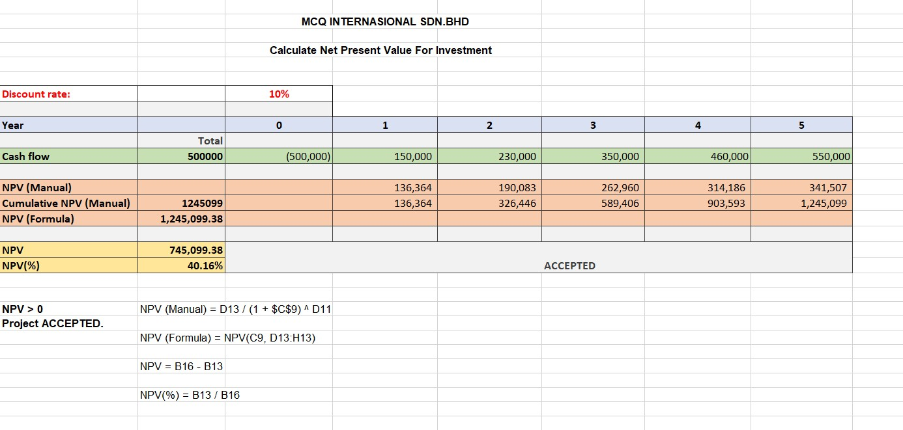

# MCQ-Marking-System

By MCQ Sdn. Bhd.

This is a simple MCQ Marking System. Built to fulfill academic requirement of the subject Artificial Intelligence Project Management (BITI 3533) of Universiti Teknikal Malaysia Melaka (UTeM)

## Project Management Framework

- *Scope Management* 

 In Scope Management, the deliverables and outcome of the project are identified defined, and controlled. The scope of the project is adjusted to ensure that the project can be completed within the constraints of the project, such as time and resources.  

- *Time Management* 

 Project time management refers to a component of overall project management in which a timeline is examined and developed for the completion of a project or deliverable. For our project, the duration of this project is 14 weeks. Gantt chart can be made, and critical path need to be determined to identify all the processes and its duration in completing the project.  

- *Cost Management* 
 
 In cost management, costs are estimated before accepting a project. After coming up with an agreed budget with the client, the team must manage the expenditure carefully, Expenditure must be controlled to ensure that the project is completed without overbudget. For our project, expected expenditure is around RM500.
 
 
- *Quality Management* 

 Generally, quality management is divided into 2 parts, quality planning and quality control.  

 Quality planning specifies the acceptance criteria that is used to measure the quality of output of the project. The criteria is used in the development as a mean of quality control. 

 Quality control consists of inspection, measurement and testing to verify that the project outputs meet acceptance criteria defined during quality planning. It is focused on preventing problems being passed on to the internal or external customer. 

 Our team will keep track of each other’s progress based on each individual’s progression throughout the project through Github. We would have discussions each week to figure out better ways to improve the system. 
 
 
 
 - *Human Resource Management* 
 
  Human resource management is a strategic and comprehensive approach to manage people and the workplace culture and environment. In short, it manages all the issues related to people in an organization. In our project, we would hire more worker if necessary if we feel the project is too overwhelming for 3 workers to handle in order to decrease everyone’s workload and improve efficiency at the same time.  

 Project Manager will monitor and ensure there is communications between each and every department. Project Manager will also conduct a general meeting every week where each department would update their progress, so everyone is crystal clear on the project progression.  
 
 
 - *Human Resource Management*
 
 Human resource management is a strategic and comprehensive approach to manage people and the workplace culture and environment. In short, it manages all the issues related to people in an organization. In our project, we would hire more worker if necessary if we feel the project is too overwhelming for 3 workers to handle in order to decrease everyone’s workload and improve efficiency at the same time.  

 Project Manager will monitor and ensure there is communications between each and every department. Project Manager will also conduct a general meeting every week where each department would update their progress, so everyone is crystal clear on the project progression.  
 
 
 - *Communications Management*
 
 Communications management is the systematic planning, implementing, monitoring, and revision of all the channels of communication within an organization, and between organizations. With effective communication, the project can be carried out at a smoother pace due to less interruption from miscommunication. 

 We would identify possible obstacles we may encounter during the time of this project and providing solution and backup plan as well to make sure the project’s progress is not jeopardized.  
 
 
 - *Risk Management*
 
 Risk management is the process of identification, analysis and acceptance or mitigation of uncertainty in the project. We would identify possible risks of a project, come up with solution to minimize or eliminate risks as well as contingency plan are made to make sure the project’s progress is not jeopardized. 
 
 
 - *Procurement Management*
 
 Procurement management is a strategic approach to manage and optimise project spending. We would plan out our spending ensure the items we buy for the project is the best price after thorough survey on the current market.  
 
 
 - *Project Integration Management*
 
 Project integration management happens from the start to the finish of a project. It touches on every aspect of project management. It integrates all the aspects discussed earlier in order to produce a complete project. We would select a capable team member to be the team leader, as integration management is very important part and should be handled by team leader only. 
 
 ## Simple Work Breakdown Structure
 
 
 
 ## Gantt Chart
 
 
 
 
 ## Net Present Value (NPV)
 
  
 
 
 

 
 
